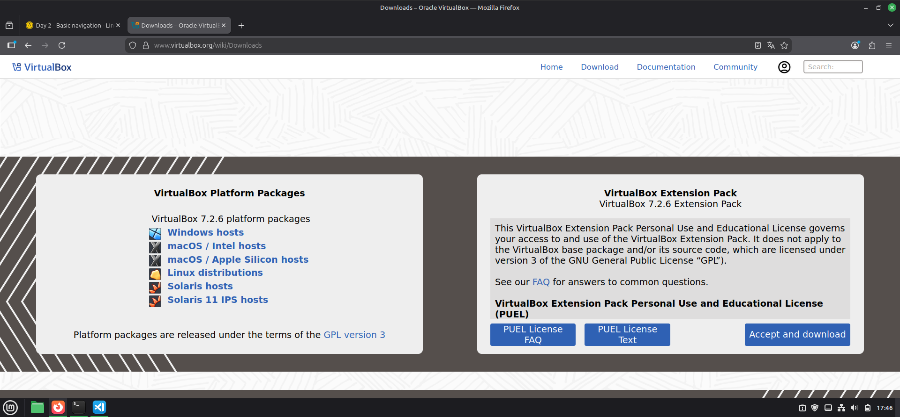
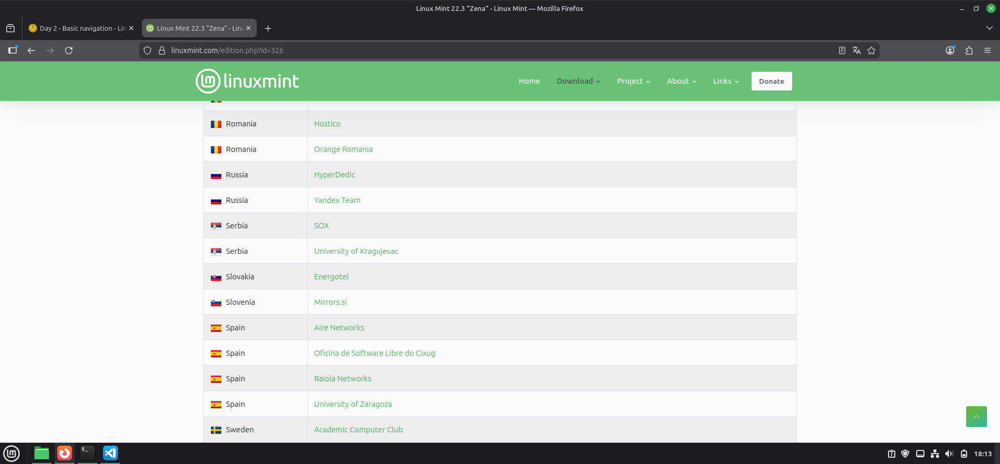
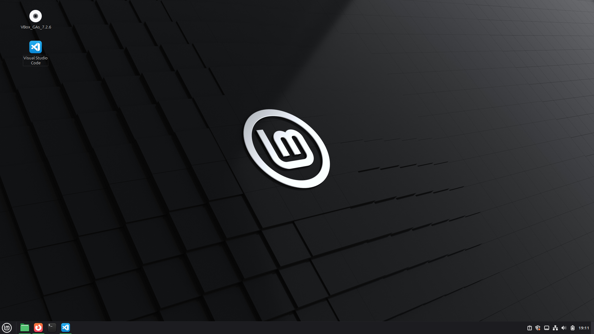

# Linux in a VM

This MarkDown document has the sole purpose of helping new
users with the set-up of their first VM and their first steps in this vibrant open-source community.

## Prerequisites

- **Oracle Virtual-Box**: There are plenty of VM out there, if you feel more comfortable with other type of VM fell free to use it.
  - *For the sake of the guide all the explanations will be Oracle focused*.
  
- **Linux Distro**: This point may change from a user to an other. Choose a distro that matches your expectations and what you were planning to do with Linux in the first place.
  - *All the guide will be focus around Mint, to be more precise, Cinnamon because is one of the most beginner-friendly distro out there*.
  
- **System Resources**: Keep an eye of your actual resources, a VM can be quite heavy to set-up (in terms of CPU and RAM) if you want to work smoothly.
  
  *Note: My specifications are: 2 CPUs and 4GB of RAM, even with this it lags sometimes*

## Set Up Guide

### Installation and configuration

**Download Virtual-Box**: This step is one of the easiest one, we only need to open our browser and search for Oracle VirtualBox. This being done, we are going to download the version that matches our OS (a x64 version is preferable) and we can proceed with the installation.

1. **Setting Up the VM**: Most of the installation will be in an auto mode, we only need to set some characteristics for our VM.

    1. First of all, let´s double check the Iso image that we should have already download. As I said I used the Mint one.
    
    *Note: As you will see we have several "Mirrors", to make things simple they are exactly the same image only changes the connection to it (see before installing as this may drag your VM).*

    2. With the VM ready and the ISO file downloaded we can start with the settings.

       1. The only manual work that we are doing here is the following:
       - In the ISO space we are going to put our downloaded iso (from now on this will be our distro).
       - The setting may change depending of your computer specifications but at least 1-2 CPUs and 4GB of RAM (this can get clancky as you generate new directories and folders but should be enough for beginners).
       - With this done, and unchecking the EFI space, the rest can go on auto.

    3. Launch the VM once the configuration ends, if the installation went smoothly you should see the distro logo.

    4. Congrats! You can now run Linux in your Windows or Mac. Feel free to touch, break, and set the things up again. This is the only true way of learning!.
    
